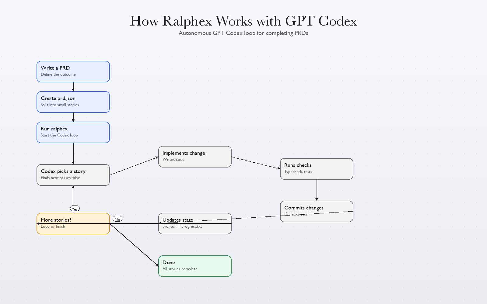

# Ralphex

Ralphex is an autonomous GPT Codex agent loop for ChatGPT Pro accounts, tuned for budget-friendly iterations. Each iteration is a fresh Codex instance with clean context. Memory persists via git history, `progress.txt`, and `prd.json`.
Demo heartbeat: see `docs/ralph-demo.txt`.

## Prerequisites

- GPT Codex CLI or OpenCode wrapper installed and authenticated
  - Install Codex: `npm install -g @openai/codex`
  - Authenticate (Codex Pro): `codex login`
  - Authenticate (API key): `printenv OPENAI_API_KEY | codex login --with-api-key`
  - Auto-login support: if `OPENAI_API_KEY` is set, `ralph.sh` will attempt a login automatically
  - External auth (OpenCode): set `CODEX_SKIP_LOGIN_CHECK=1`
  - OpenCode driver: set `CODEX_DRIVER=opencode` to use OpenCode OAuth
- `jq` installed (`brew install jq` on macOS)
- A git repository for your project

## Setup

### Option 1: Copy to your project

Copy the ralph files into your project:

```bash
# From your project root
mkdir -p scripts/ralph
cp /path/to/ralph/ralph.sh scripts/ralph/
cp /path/to/ralph/ralphex scripts/ralph/
cp /path/to/ralph/raphex scripts/ralph/

# Copy the prompt template for Codex:
cp /path/to/ralph/CODEX.md scripts/ralph/CODEX.md

chmod +x scripts/ralph/ralph.sh scripts/ralph/ralphex scripts/ralph/raphex
```

## Quick Start: ChatGPT Pro + OpenCode

If you are building on a tight budget with ChatGPT Pro, this is the fastest path with minimal setup. OpenCode handles OAuth so you do not need API keys.

1. Copy these files into your project root:
   - `ralph.sh`
   - `ralphex`
   - `raphex`
   - `CODEX.md`
2. Make the wrapper executable:
   - `chmod +x ralphex raphex`
3. Log in once with OpenCode:
   - `opencode auth login`
4. Add a `prd.json` to your project root.
5. Run:
   - `./ralphex`
   - or `./raphex`

Ralphex will print the ASCII banner, then run until all stories pass.

## What We Built (Walkthrough)

- **Codex loop with OpenCode fallback**: `ralph.sh` uses the Codex CLI when logged in, and falls back to OpenCode OAuth when not.
- **One-command runner**: `./ralphex` defaults to `CODEX_DRIVER=opencode` and `CODEX_MODEL=openai/gpt-5.2-codex`.
- **Active/Deactivated banner**: Ralphex prints a big ASCII banner with `ACTIVE 🟢` or `DEACTIVATED 🔴`.
- **Deactivation switch**: `./ralphex off` or `./raphex off` creates `.ralphex-disabled`; `./ralphex on` or `./raphex on` removes it; `./ralphex status` reports state.
- **Clean exit when done**: if no stories remain, Codex emits `<promise>COMPLETE</promise>` and the loop stops.

## Run From Anywhere

If `ralphex` is on your PATH, you can run it from any directory. It will locate the Ralphex project folder and execute from there.

Add `ralphex` to your PATH (one-time setup):
```bash
# Add the ralphex directory to PATH
export PATH="/path/to/ralphex:$PATH"

# Or symlink the binary into /usr/local/bin
ln -s /path/to/ralphex/ralphex /usr/local/bin/ralphex
```

Recommended (fast, explicit):
```bash
export RALPHEX_HOME="/path/to/ralphex"
ralphex
```

Optional (search-based):
```bash
export RALPHEX_SEARCH_ROOTS="$HOME:/Users/Shared"
ralphex
```

When found, you can still run `ralphex on`, `ralphex off`, or `ralphex status` from anywhere.

## Workflow

### 1. Create a PRD

Create `prd.json` with user stories for the loop. Use `prd.json.example` as a template if you want a starting point.

### 2. Run Ralph

```bash
# One-command Codex loop (OpenCode OAuth by default)
./ralphex [max_iterations]

# Short alias (typo-friendly)
./raphex [max_iterations]

# If you installed into scripts/ralph
./scripts/ralph/ralphex [max_iterations]
./scripts/ralph/raphex [max_iterations]

# Legacy alias (still works)
./ralphcodex [max_iterations]

# Toggle Ralphex on/off
./ralphex off
./ralphex on
./ralphex status

# Alias works too
./raphex off
./raphex on
./raphex status

# Run with Codex directly (set CODEX_CMD if needed)
CODEX_CMD="codex" ./scripts/ralph/ralph.sh --tool codex [max_iterations]

# Cap the loop (optional)
./ralph.sh 25

# Bootstrap from example PRD (for demos only):
PRD_BOOTSTRAP=1 ./scripts/ralph/ralph.sh [max_iterations]
```

Default is infinite iterations. Pass a number to cap the loop (for example, `./ralph.sh 10`). The loop always runs in Codex mode.

For Codex, set `CODEX_CMD` to the command that accepts prompt text on stdin, for example:

```bash
CODEX_CMD="codex exec --dangerously-bypass-approvals-and-sandbox" ./scripts/ralph/ralph.sh --tool codex

# If your environment already manages auth (e.g., OpenCode), bypass the login check:
CODEX_SKIP_LOGIN_CHECK=1 ./scripts/ralph/ralph.sh --tool codex

# Use OpenCode as the Codex driver (uses OpenAI OAuth):
CODEX_DRIVER=opencode CODEX_MODEL="openai/gpt-5.2-codex" ./scripts/ralph/ralph.sh --tool codex
```

Ralphex will:
1. Create a feature branch (from PRD `branchName`)
2. Pick the highest priority story where `passes: false`
3. Implement that single story
4. Run quality checks (typecheck, tests)
5. Commit if checks pass
6. Update `prd.json` to mark story as `passes: true`
7. Append learnings to `progress.txt`
8. Repeat until all stories pass or max iterations reached

If `prd.json` is missing, `ralph.sh` will exit with instructions. To auto-copy the example, set `PRD_BOOTSTRAP=1`.

## Deactivate Ralphex

To pause the loop (useful if you want GPT Codex to stop running Ralphex):

```bash
# Create a flag file to deactivate
touch .ralphex-disabled

# Or set an env var for a single run
RALPH_DISABLED=1 ./ralph.sh
```

When deactivated, Ralphex prints a banner and exits. To override:

```bash
RALPH_FORCE=1 ./ralph.sh
```

## Key Files

| File | Purpose |
|------|---------|
| `ralph.sh` | The bash loop that spawns GPT Codex instances (codex only) |
| `ralphex` | One-command wrapper for Codex/OpenCode |
| `raphex` | Alias for `ralphex` |
| `CODEX.md` | Prompt template for GPT Codex |
| `prd.json` | User stories with `passes` status (the task list) |
| `prd.json.example` | Example PRD format for reference |
| `progress.txt` | Append-only learnings for future iterations |
| `flowchart/` | Standalone flowchart explaining the loop |

## Flowchart



Open `flowchart/index.html` directly, or run a local server:

```bash
cd flowchart
python3 -m http.server 5173
```

## Critical Concepts

### Each Iteration = Fresh Context

Each iteration spawns a **new GPT Codex instance** with clean context. The only memory between iterations is:
- Git history (commits from previous iterations)
- `progress.txt` (learnings and context)
- `prd.json` (which stories are done)

### Small Tasks

Each PRD item should be small enough to complete in one context window. If a task is too big, the LLM runs out of context before finishing and produces poor code.

Right-sized stories:
- Add a database column and migration
- Add a UI component to an existing page
- Update a server action with new logic
- Add a filter dropdown to a list

Too big (split these):
- "Build the entire dashboard"
- "Add authentication"
- "Refactor the API"

### AGENTS.md Updates Are Critical

After each iteration, Ralphex updates the relevant `AGENTS.md` files with learnings. This is key because AI coding tools automatically read these files, so future iterations (and future human developers) benefit from discovered patterns, gotchas, and conventions.

Examples of what to add to AGENTS.md:
- Patterns discovered ("this codebase uses X for Y")
- Gotchas ("do not forget to update Z when changing W")
- Useful context ("the settings panel is in component X")

### Feedback Loops

Ralphex only works if there are feedback loops:
- Typecheck catches type errors
- Tests verify behavior
- CI must stay green (broken code compounds across iterations)

### Browser Verification for UI Stories

Frontend stories must include "Verify in browser using dev-browser skill" in acceptance criteria. Ralphex will use the dev-browser skill to navigate to the page, interact with the UI, and confirm changes work.

### Stop Condition

When all stories have `passes: true`, Ralphex outputs `<promise>COMPLETE</promise>` and the loop exits.

## Debugging

Check current state:

```bash
# See which stories are done
cat prd.json | jq '.userStories[] | {id, title, passes}'

# See learnings from previous iterations
cat progress.txt

# Check git history
git log --oneline -10
```

## Customizing the Prompt

After copying `CODEX.md` to your project, customize it for your project:
- Add project-specific quality check commands
- Include codebase conventions
- Add common gotchas for your stack

## Archiving

Ralphex automatically archives previous runs when you start a new feature (different `branchName`). Archives are saved to `archive/YYYY-MM-DD-feature-name/`.

## References

- [Geoffrey Huntley's Ralph article](https://ghuntley.com/ralph/)
